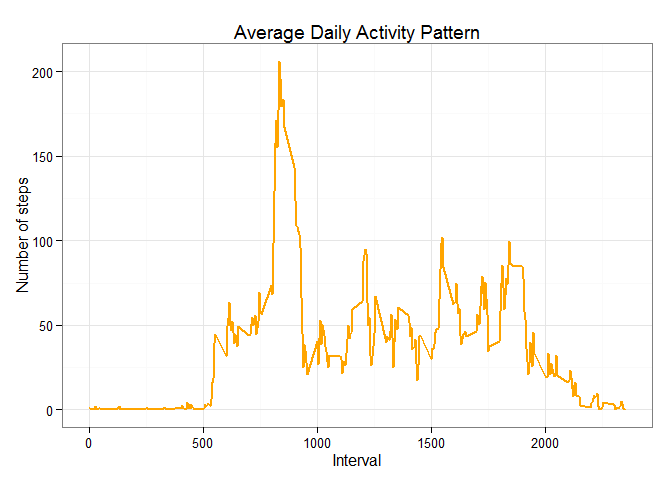

Coursera: Reproducible Research: Peer Assessment 1
==================================================
created by Santiago Cardarelli

##1-.Loading and preprocessing the data

For loading the data I need the following libraries and a read.csv

```r
library(knitr)
library(data.table)
library(ggplot2)

rdata <- read.csv('data/activity.csv', header = TRUE, sep = ",",colClasses=c("numeric", "character", "numeric"))
```

Then i need to convert the data in order to have it prepared for the questions

```r
rdata$date <- as.Date(rdata$date, format = "%Y-%m-%d")
rdata$interval <- as.factor(rdata$interval)
```


##2-.What is mean total number of steps taken per day?

In this section I calculate the total number of steps taken per day

```r
steps_per_day <- aggregate(steps ~ date, rdata, sum)
colnames(steps_per_day) <- c("date","steps")
```

In this plot you can see the total number of steps taken by day

 

In this section, I calculate the mean and median of the total number of steps taken per day

```r
steps_mean   <- mean(steps_per_day$steps, na.rm=TRUE)
steps_median <- median(steps_per_day$steps, na.rm=TRUE)
```


##3-.What is the average daily activity pattern?

In order to make a time series plot of the 5-minute interval (x-axis) and the average number of steps taken, averaged across all days (y-axis), I need the following code:

```r
steps_per_interval <- aggregate(rdata$steps,by = list(interval = rdata$interval),FUN=mean, na.rm=TRUE)
steps_per_interval$interval <- as.integer(levels(steps_per_interval$interval)[steps_per_interval$interval])
colnames(steps_per_interval) <- c("interval", "steps")
```

The plotting is the following:

 

The next question is which 5-minute interval, on average across all the days in the dataset, contains the maximum number of steps? The following code calcultes the maximum number of steps:

```r
max_interval <- steps_per_interval[which.max(steps_per_interval$steps),]
```


##4-.Imputing missing values

I have to calculate and report the total number of missing values in the dataset (i.e. the total number of rows with NAs)

```r
missing_vals <- sum(is.na(rdata$steps))
```

With the following code I will do all the calculations needed for the plot:

```r
na_fill <- function(data, pervalue) {
  na_index <- which(is.na(data$steps))
  na_replace <- unlist(lapply(na_index, FUN=function(idx){
    interval = data[idx,]$interval
    pervalue[pervalue$interval == interval,]$steps
  }))
  fill_steps <- data$steps
  fill_steps[na_index] <- na_replace
  fill_steps
}

rdata_fill <- data.frame(  
  steps = na_fill(rdata, steps_per_interval),  
  date = rdata$date,  
  interval = rdata$interval)

fill_steps_per_day <- aggregate(steps ~ date, rdata_fill, sum)
colnames(fill_steps_per_day) <- c("date","steps")
```

I report the results with an Histogram:

 

With the following code I can see that the values do not differ from the estimates from the first part of the assignment:

```r
steps_mean_fill   <- mean(fill_steps_per_day$steps, na.rm=TRUE)
steps_median_fill <- median(fill_steps_per_day$steps, na.rm=TRUE)
```


##5-.Are there differences in activity patterns between weekdays and weekends?

For this question I will use the lattice library and I will read the activity file again:

```r
library(lattice)
activity <- read.csv('data/activity.csv', header = TRUE, sep = ",",colClasses=c("numeric", "character", "numeric"))
activity$date <- as.Date(activity$date, "%Y-%m-%d")
day <- weekdays(activity$date)
daylevel <- vector()
for (i in 1:nrow(activity)) {
  if (day[i] == "sábado") {
    daylevel[i] <- "Weekend"
  } else if (day[i] == "domingo") {
    daylevel[i] <- "Weekend"
  } else {
    daylevel[i] <- "Weekday"
  }
}
activity$daylevel <- daylevel
activity$daylevel <- factor(activity$daylevel)

stepsByDay <- aggregate(steps ~ interval + daylevel, data = activity, mean)
names(stepsByDay) <- c("interval", "daylevel", "steps")
```


In the panel plot you can the comparison between weekdays and weekend days.
 

Note: the day names are in spanish because of my computer settings.
